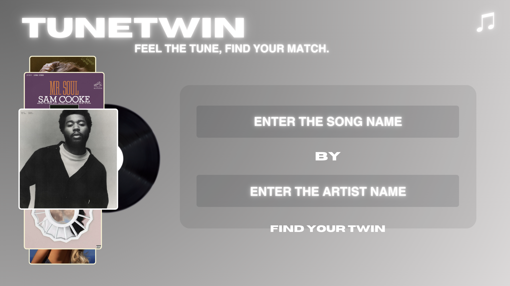

# TuneTwin 🎧

**TuneTwin** is a music recommendation tool that uses the Spotify API, LastFM API, and Deezer API to help you discover new music. Just enter your favorite song, and TuneTwin will find tracks with a similar vibe. Whether you want to expand your playlists or explore new artists, TuneTwin makes music discovery easy and personalized!

## Features

- **Song-Based Recommendations**: Enter a favorite song, and TuneTwin finds similar tracks using the LastFM API.
- **Personalized Discovery**: Explore music tailored to your tastes.
- **Simple and Intuitive Interface**: Easy-to-use interface for seamless music discovery.

🔗 **Check it out here**: [https://tunetwin.ca/]([https://tunetwin.ca/](https://tune-twin-2-0.vercel.app/))

---

## How It Works

1. **Input**: Enter your favorite song.
2. **API Call**: TuneTwin uses the LastFM API to find similar songs.
3. **Results**: Receive personalized song recommendations.

---

## Technologies Used

- **Python** (Flask) – For the web server.
- **LastFM API** – For fetching song recommendations.
- **Spotify and Deezer APIs** – For fetching album covers.
- **HTML/CSS** – For the user interface.
- **Requests** – For making HTTP requests to the LastFM API.
- **Dotenv** – For managing environment variables.

---

